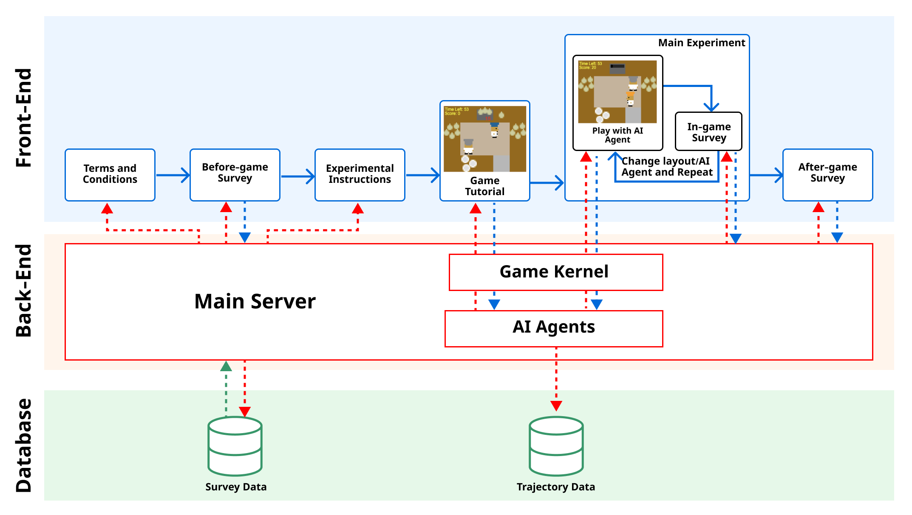

# README

Welcome to the official GitHub repository for the research paper "Tackling Cooperative Incompatibility for Zero-Shot Human-AI Coordination". This paper, submitted to the Special Track on Hybrid Human-Artificial Intelligence in the Journal of Artificial Intelligence Research (JAIR), is an extension of the paper [Cooperative Open-ended Learning Framework for Zero-shot Coordination](https://arxiv.org/abs/2302.04831), which was accepted by ICML 2023.

You can access our hands-on [demo page](https://sites.google.com/view/cole-jair).

This repository introduces a human-AI evaluation platform built around the Overcooked game, designed to support Human-AI experiments. Overcooked, a two-player fully cooperative game. The system is shown as follows.

<p align="center">
  
  <br>
</p>
Here, you're granted the ability to:

- Upload your weights
- Customize the human questionnaire
- Configure game settings
- And many more!

Our codebase is a modified version of the [PECAN](https://github.com/LxzGordon/PECAN) repository, adapted to better suit our specific research needs. Besides, we integrate [Human-Aware-RL](https://github.com/HumanCompatibleAI/human_aware_rl/tree/neurips2019) agent models with the [PantheonRL](https://github.com/Stanford-ILIAD/PantheonRL) framework for convenient human-ai coordination study on Overcooked. Changes are done under the [overcookedgym/overcooked-flask](https://github.com/LxzGordon/pecan_human_AI_coordination/tree/master/overcookedgym/overcooked-flask) directory.

# Getting Started

## 1. How to setup
Install [PantheonRL](https://github.com/Stanford-ILIAD/PantheonRL) in this repo
 ```shell
    conda create -n overcooked-vis python=3.7
    conda activate overcooked-vis
    pip install -r requirements.txt
    pip install -e .
```

Install mpi4py

```shell
conda install mpi4py
```

Install PyTorch (based on your CUDA version): https://pytorch.org/
(You don't actually need the GPU version to run the game)


Install human_aware_rl and its dependencies: overcooked_ai, baselines & stable_baselines
 ```shell
    cd overcookedgym/human_aware_rl
    pip install -e .
    cd overcooked_ai
    pip install -e .
    cd ..
    cd stable-baselines
    pip install -e .
    cd ..
    cd baselines
    pip install -e .
```


## 2. How to load models

You need to put your model file in `./models`. You can get our trained models [here](https://drive.google.com/drive/folders/1s88a_muyG6pVlfcKDKop6R1Fhxr8dcGH?usp=share_link), including BC, self-play, population-based training, [FCP](https://arxiv.org/abs/2110.08176), [MEP](https://arxiv.org/abs/2112.11701), [COLE](https://arxiv.org/abs/2302.04831).

In addition, you can load your own models if they are trained using the [Human-Aware-RL](https://github.com/HumanCompatibleAI/human_aware_rl/tree/neurips2019) framework. 
Agents are loaded using the `get_agent_from_saved_model()` method, which loads tensorflow predictor models (`.pb` files), so you should save your agents in this style if you wish to load them into our framework. You can reference to the `save` method in `human_aware_rl/pbt/pbt.py` for saving agents that can be loaded.

To load your own models, you need to put them in the `./models` folder in a named folder (the folder names need to be the same for all layouts), and the models would be loaded upon starting the server. For example. If your algo is named `ABC`, then the folder structure should look like this:
```
-- models
  | --  simple
       | -- SP        <---- Baseline 1 
       | -- PBT       <---- Baseline 2
          ...
       | -- ABC       <---- Your Algorithm
  | --  unident_s
       | -- SP        <---- Baseline 1 
       | -- PBT       <---- Baseline 2
          ...
       | -- ABC       <---- Your Algorithm
  | --  random1
       | -- SP        <---- Baseline 1 
       | -- PBT       <---- Baseline 2
          ...
       | -- ABC       <---- Your Algorithm
  ...
``` 

## 3. How to run

```shell
python overcookedgym/overcooked-flask/app.py --trajs_savepath ./trajs --ckpts ./models
```

- `--ckpts`: Folder containing all the AI models to be loaded. Default is `./models`.
- `--port`: The port where you run the server process.
- `--trajs_savepath`: Optional trajectory save path, default is `./trajs`.
- `--questionnaire_savepath`: Optional questionnaire save path, default is `./questionnaire`.
- `--ip`: Default is LOCALHOST, we **recommend you replace it with your public network IP**, because of a known bug of Flask that may cause extreme lag when playing the game. The same applies when debugging, you should visit your machine's IP in your browser instead of LOCALHOST.

## 4. How to customize

### Customize experiment statements
You can replace `configs/statement.md` by your experiment statement markdown file, then restarting your web process.

### Customize before game questionnaire.
You can modify `configs/before_game.yaml` to customize your settings of before game questionnaire.

## 5. How to collect data
Questionnaire data are saved in `./questionnaire`, its corresponging co-play trajectorys is saved in `./trajs`.

We also privide a simple data processing scripts named `questionnaire_analyze.ipynb.`

# License
[MIT License](LICENSE.md)

# Citation
Please cite
 ```
@article{li2023cooperative,
  title={Cooperative Open-ended Learning Framework for Zero-shot Coordination},
  author={Li, Yang and Zhang, Shao and Sun, Jichen and Du, Yali and Wen, Ying and Wang, Xinbing and Pan, Wei},
  journal={arXiv preprint arXiv:2302.04831},
  year={2023}
}

@article{lou2023pecan,
  title={PECAN: Leveraging Policy Ensemble for Context-Aware Zero-Shot Human-AI Coordination},
  author={Lou, Xingzhou and Guo, Jiaxian and Zhang, Junge and Wang, Jun and Huang, Kaiqi and Du, Yali},
  journal={arXiv preprint arXiv:2301.06387},
  year={2023}
}
 ```

 ```
 @inproceedings{sarkar2022pantheonrl,
  title={PantheonRL: A MARL Library for Dynamic Training Interactions},
  author={Sarkar, Bidipta and Talati, Aditi and Shih, Andy and Sadigh, Dorsa},
  booktitle={Proceedings of the AAAI Conference on Artificial Intelligence},
  volume={36},
  number={11},
  pages={13221--13223},
  year={2022}
}
 ```

 ```
@article{carroll2019utility,
  title={On the utility of learning about humans for human-ai coordination},
  author={Carroll, Micah and Shah, Rohin and Ho, Mark K and Griffiths, Tom and Seshia, Sanjit and Abbeel, Pieter and Dragan, Anca},
  journal={Advances in neural information processing systems},
  volume={32},
  year={2019}
}
 ```
